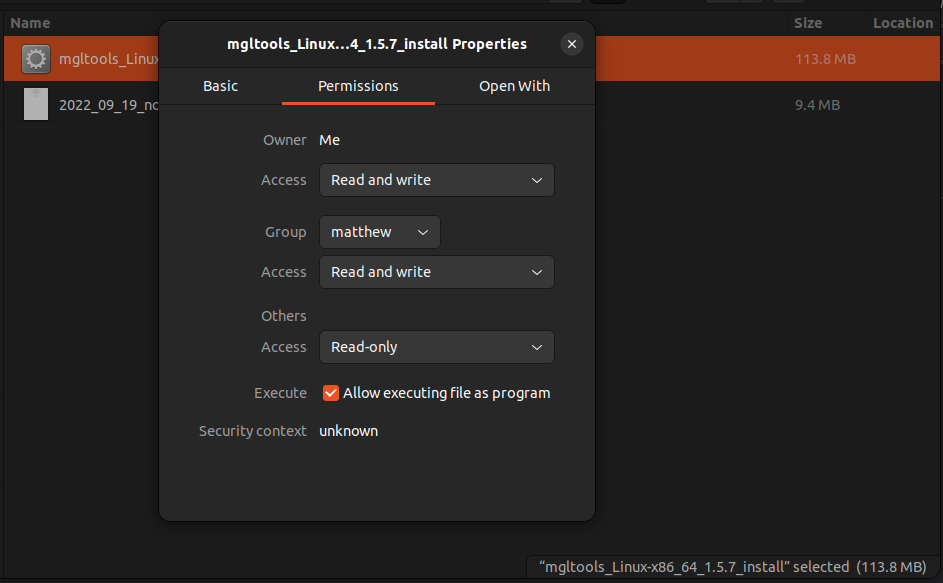
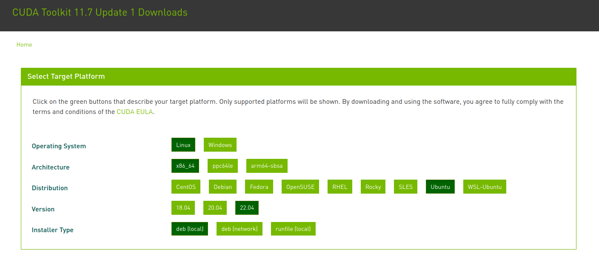
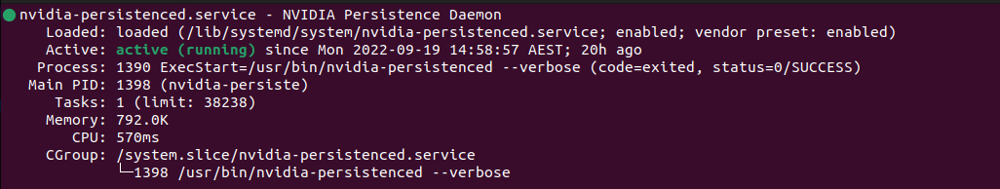
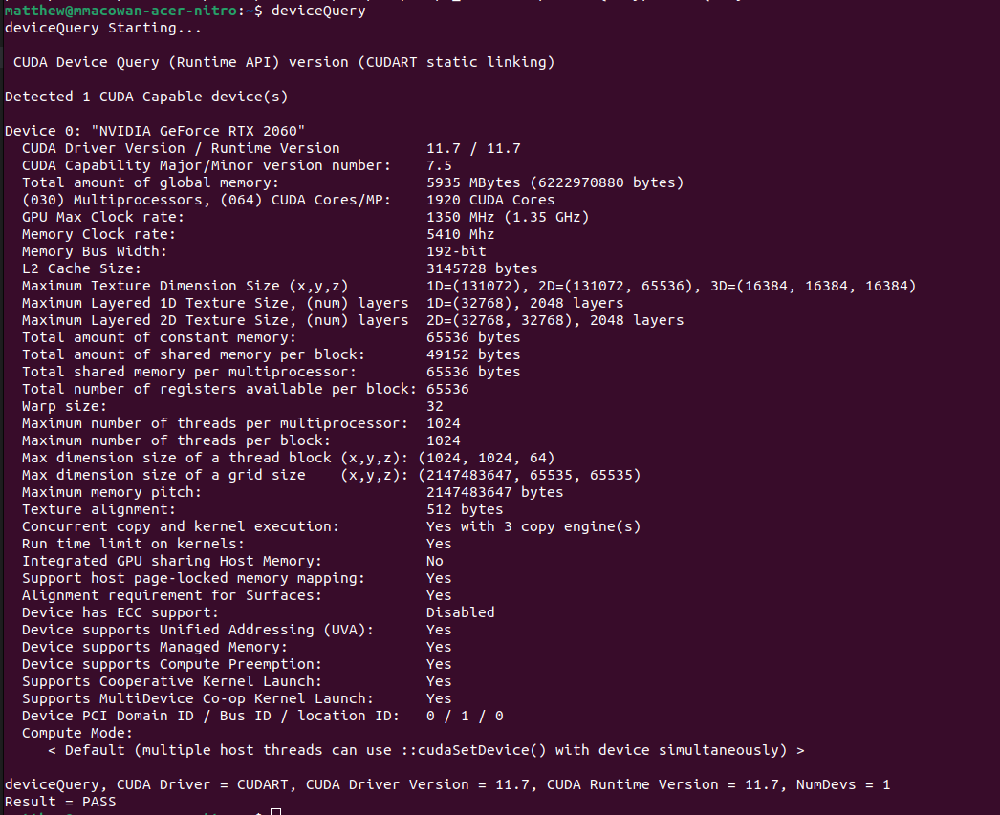
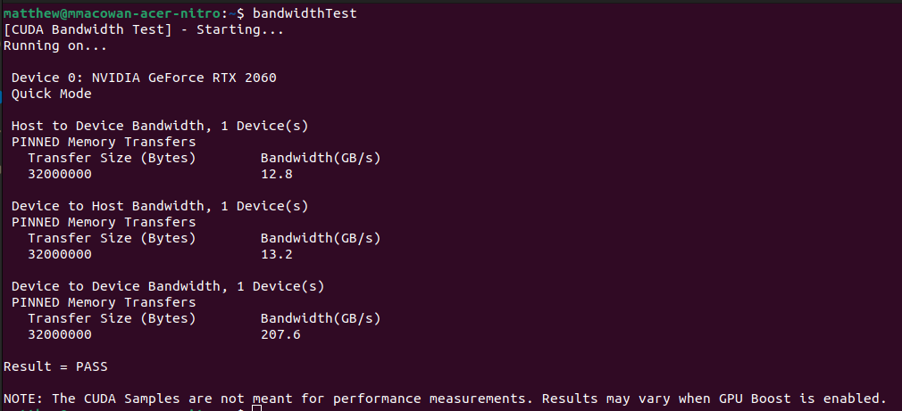

# AutoDock-GPU

AutoDock-GPU [(Santos-Martins 2021)](https://pubmed.ncbi.nlm.nih.gov/33403848/) is an OpenCL implementation of the widely used tool AutoDock4 (for the docking of small molecules to macromolecular targets) that leverages the highly parallel architecture of GPU hardware to reduce docking runtime by up to 350-fold with respect to a single-threaded process. In addition, the gradient-based local search method ADADELTA, as well as an improved version of the Solis-Wets random optimiser from AutoDock4 reduces the number of calls to the scoring function that are needed to produce good results.

Here we will discuss the installation and running of this tool on a **Linux**-based operating system.

## Requirements

* Administrator privileges.
* An NVIDIA-based GPU system capable of running [CUDA](https://developer.nvidia.com/cuda-toolkit).

## Installation

### AutoDock4 and AutoGrid4

If you already have a dedicated location in which to store tools, navigate to that folder. Otherwise first we will create a new folder within our Documents folder.

To install AutoDock4 and AutoGrid4, you will need administrator privileges.

```bash
# Create the new directory and navigate to it
mkdir ~/Documents/Tools

# Install AutoDock4 and AutoGrid4
sudo apt install autodock
sudo apt install autogrid
```

### MGLTools

Next we need to install MGLTools from the browser using this [link](https://ccsb.scripps.edu/mgltools/downloads/). Choose the GUI installer option for Linux, which has the file name `mgltools_Linux-x86_64_xxx_Install`.

We need to give the installer permission to execute as a program. Right-click the file, switch to the `Permissions` tab, and check the box at the bottom that says `Allow executing file as program`.

<p align="center">
    
</p>

Now we can double-click on the install file, and follow the prompts to install MGTools.

Once you have successfully completed this, we need to add MGTools to the `PATH`. The easiest way to "set and forget" this step is to add this step to our `.bashrc` file (this file runs a given set of instructions every time you start an instance of the terminal).

If you have installed MGLTools in a location other than the home directory, alter the code below as necessary. Also amend the version number if you have installed a different version of MGLTools.

```bash
# Change to the home directory
cd ~

# Add the PATH export instruction to the .bashrc file
# The double greater than sign '>>' appends a new line to the given file
echo 'export PATH=$PATH:/home/{username}/MGLTools-1.5.7/bin' >> ~/.bashrc
echo 'export PATH=$PATH:/home/{username}/MGLtools-1.5.7/MGLToolsPckgs/AutoDockTools' >> ~/.bashrc
```

### CUDA

Head over to the NVIDIA [cuda-toolkit page](https://developer.nvidia.com/cuda-toolkit), click the download link, and select your operating system, system architecture, distribution (e.g. Ubuntu), version number (e.g. 22.04), and the installer type you would like. We will select `deb (local)` here.

<p align="center">
    
</p>

This will provide you with a set of command line instructions for installing the CUDA toolkit.

There will also be a link below that provides detailed installation instructions for Linux ([see here](https://docs.nvidia.com/cuda/cuda-installation-guide-linux/index.html)). These will be summarised below for the Ubuntu operating system.

#### Pre-installation instrutions

There are a few things we need to do before installing the CUDA toolkit in order to make sure our system is CUDA-capable:

##### Verify you have a CUDA-capable GPU

Firstly, we need to verify we have a CUDA-capable GPU.

```bash
# Verify we have a CUDA-capable GPU
lspci | grep -i nvidia
```

If you do not see any settings, update the PCI hardware database that Linux maintains by entering `update-pciids` (generally found in `/sbin`) at the command line and rerun the previous `lspci` command.

A list of CUDA-capable GPUs from NVIDIA can be found [here](https://developer.nvidia.com/cuda-gpus).

##### Verify you have a supported version of Linux

CUDA development tools are only supported on specific distributions of Linux, which are listed in the CUDA toolkit release notes. To determine which distribution and release number you're running, use the following command.

```bash
uname -m && cat /etc/*release
```

You should see output similar to the following, modified for your particular system.

```bash
x86_64
DISTRIB_ID=Ubuntu
DISTRIB_RELEASE=22.04
DISTRIB_CODENAME=jammy
DISTRIB_DESCRIPTION="Ubuntu 22.04.1 LTS"
PRETTY_NAME="Ubuntu 22.04.1 LTS"
NAME="Ubuntu"
VERSION_ID="22.04"
VERSION="22.04.1 LTS (Jammy Jellyfish)"
VERSION_CODENAME=jammy
ID=ubuntu
ID_LIKE=debian
HOME_URL="https://www.ubuntu.com/"
SUPPORT_URL="https://help.ubuntu.com/"
BUG_REPORT_URL="https://bugs.launchpad.net/ubuntu/"
PRIVACY_POLICY_URL="https://www.ubuntu.com/legal/terms-and-policies/privacy-policy"
UBUNTU_CODENAME=jammy
```

Ubuntu is supported in general, so if you are also running Ubuntu (either 20.04 or 22.04), you should be fine.

##### Verify the system has gcc installed

The `gcc` compiler is required for development using the CUDA toolkit, but not for running CUDA applications. In most cases however, it is already installed, and you can check the version you have by running this command.

```bash
gcc --version
```

##### Verify the system has the correct kernel headers and development packages installed

The CUDA driver requires that the kernel headers and development packages for the running version of the kernel be installed at the time of the driver installation, as well as whenever the driver is rebuilt.

The version of the kernel your system is running can be found using the following command.

```bash
uname -r
```

**Note**: if you perform a system update which changes the version of the linux kernel being used, make sure to rerun the commands below to ensure you have the correct kernel headers and kernel development packages installed. Otherwise the CUDA driver will fail to work with the new kernel.

**For Ubuntu**:

```bash
sudo apt-get install linux-headers-$(uname -r)
```

#### Install CUDA toolkit

Now we can go back and use the provided command line code to install the CUDA toolkit. For Ubuntu 22.04 OS running on x86_64 architecture, the provided code looks like:

```bash
# Download the repository pin
wget https://developer.download.nvidia.com/compute/cuda/repos/ubuntu2204/x86_64/cuda-ubuntu2204.pin

# Move the pin to the preferences.d folder
sudo mv cuda-ubuntu2204.pin /etc/apt/preferences.d/cuda-repository-pin-600

# Download the installer file
wget https://developer.download.nvidia.com/compute/cuda/11.7.1/local_installers/cuda-repo-ubuntu2204-11-7-local_11.7.1-515.65.01-1_amd64.deb

# Install the package
sudo dpkg -i cuda-repo-ubuntu2204-11-7-local_11.7.1-515.65.01-1_amd64.deb

# Copy the credentials file into the shared keyrings folder
sudo cp /var/cuda-repo-ubuntu2204-11-7-local/cuda-*-keyring.gpg /usr/share/keyrings/

# Update your packages
sudo apt-get update

# Install CUDA toolkit
sudo apt-get -y install cuda
```

Now you will need to reboot the system, and then carry on with the post-installation steps, which are split into mandatory and recommended sections.

```bash
sudo reboot
```

#### Mandatory post-installation actions

##### Environment setup

The `PATH` variable needs to include the path to the CUDA distribution bin folder. This should be the version you have downloaded, e.g. version 11.7; you may have multiple versions installed in your `/usr/local` folder.

In addition, we need to create a variable containing the path to the appropriate library file for either a 64-bit or 32-bit system.

To add these path to the `PATH` variable, we will again add to our `./bashrc` file. Here we will use the example for `cuda-11.7`

```bash
# Export the cuda distribution path
echo 'export PATH=/usr/local/cuda-11.7/bin${PATH:+:${PATH}}' >> ~/.bashrc

# LD_LIBRARY_PATH variable for 64-bit systems
echo 'export LD_LIBRARY_PATH=/usr/local/cuda-11.7/lib64${LD_LIBRARY_PATH:+:{LD_LIBRARY_PATH}}' >> ~/.bashrc

# LD_LIBRARY_PATH variable for 32-bit systems
echo 'export LD_LIBRARY_PATH=/usr/local/cuda-11.7/lib${LD_LIBRARY_PATH:+:{LD_LIBRARY_PATH}}' >> ~/.bashrc
```
##### POWER9 setup

The new features specific to the NVIDIA POWER9 CUDA driver require some additional setup in order to function properly. These additional steps are not handled by installation of CUDA packages, and failure to ensure these extra requirements are met will result in non-functional CUDA driver installation.

**NVIDIA Persistence Daemon**

Firstly, the NVIDIA Persistence Daemon should be automatically started for POWER9 installations. Check that it is running with the following command.

```bash
systemctl status nvidia-persistenced
```

If it is not active, run the following command, and then rerun the command above to confirm everything is working correctly.

```bash
sudo systemctl enable nvidia-persistenced
```

If the NVIDIA Persistence Daemon is running correcly, the first command should produce an output that looks like this:

<p align="center">
    
</p>

**udev rule update**

Secondly, there is a udev rule installed by default in some Linux distribution (including Ubuntu) that we need to disable. This rule causes hot-pluggable memory to be automatically onlined when it is physically probed. This behaviour prevents NVIDIA software from bringing NVIDIA device memory online with non-default settings. This udev rule must be disabled in order for the NVIDIA CUDA driver to function properly on POWER9 systems.

In Ubuntu 22.04, this rule can be found here:

```bash
/lib/udev/rules.d/40-vm-hotadd.rules
```

The file contents originally look like this:

```bash
# On Hyper-V and Xen Virtual Machines we want to add memory and cpus as soon as they appear
ATTR{[dmi/id]sys_vendor}=="Microsoft Corporation", ATTR{[dmi/id]product_name}=="Virtual Machine", GOTO="vm_hotadd_apply"
ATTR{[dmi/id]sys_vendor}=="Xen", GOTO="vm_hotadd_apply"
GOTO="vm_hotadd_end"

LABEL="vm_hotadd_apply"

# Memory hotadd request
SUBSYSTEM=="memory", ACTION=="add", DEVPATH=="/devices/system/memory/memory[0-9]*", TEST=="state", ATTR{state}!="online", ATTR{state}="online"

# CPU hotadd request
SUBSYSTEM=="cpu", ACTION=="add", DEVPATH=="/devices/system/cpu/cpu[0-9]*", TEST=="online", ATTR{online}!="1", ATTR{online}="1"

LABEL="vm_hotadd_end"
```

What we need to do is copy this rule to the `/etc/udev/rules.d` folder, and then disable the "Memory hotadd request" rule by commenting out, removing, or changing the hot-pluggable memory rule in the `/etc` copy so that it does not apply to POWER9 NVIDIA systems.

The easiest way to do this is as follows, and will require a reboot once completed to initialise the changes.

```bash
# Copy the original rule file into /etc/udev/rules.d
sudo cp /lib/udev/rules.d/40-vm-hotadd.rules /etc/udev/rules.d

# Use the stream editor to delete the memory subsystem line
sudo sed -i '/SUBSYSTEM=="memory", ACTION=="add"/d' /etc/udev/rules.d/40-vm-hotadd.rules

# Reboot the system
sudo reboot
```

#### Recommended post-installation actions

##### Install Persistence Daemon

NVIDIA provides Linux with a user-space daemon to support persistence of driver state across CUDA job runs. The daemon approach provides a more elegant and robust solution to this problem than persistence mode (see [here](http://docs.nvidia.com/deploy/driver-persistence/index.html#persistence-daemon) for more details).

The NVIDIA Persistence Daemon can be started as the root user by running:

```bash
/usr/bin/nvidia-persistenced --verbose
```

##### Verify the installation

Install the sample programs, located at [https://github.com/nvidia/cuda-samples](https://github.com/nvidia/cuda-samples).

**Note**: ensure the PATH and, if using the runtime installation method, LD_LIBRARY_PATH variables are set correctly (as above).

Get the CUDA samples using the following instructions.

1. Clone the git repository into `~/Documents/Tools`.
2. Change into the directory and run the Makefile.
3. Add the `deviceQuery` folder `PATH` export command to your `.bashrc` file.
4. Add the `bandwidthTest` folder `PATH` export command to your `.bashrc` file.
5. Restart the terminal, and run `deviceQuery`.
6. Run `bandwidthTest`.

```bash
# Change to the Tools directory and clone the Git repository
cd ~/Documents/Tools
git clone https://github.com/NVIDIA/cuda-samples.git

# Change into the downloaded directory and run the Makefile
cd cuda-samples
make

# Add the deviceQuery function to your PATH
echo 'export PATH=$PATH:~/Documents/Tools/cuda-samples/Samples/1_Utilities/deviceQuery' >> ~/.bashrc

# Add the bandwidthTest function to your PATH
echo 'export PATH=$PATH:~/Documents/Tools/cuda-samples/Samples/1_Utilities/bandwidthTest' >> ~/.bashrc
```

**deviceQuery**

```bash
# After restarting the terminal, run the deviceQuery command
deviceQuery
```

If a CUDA-capable device and the CUDA driver are installed, you should get an output like this:

<p align="center">
    
</p>

The exact appearance and the output lines may be different on your system. The important outcomes are that a device was found (`Detected 1 CUDA Capable device(s)`), that the device matches the one on your system (`CUDA Driver Version / Runtime Version`), and that the test passed (final line: `Result = PASS`).

If a CUDA-capable device and the CUDA driver are installed but `deviceQuery` reports that no CUDA-capable devices are present, this likely means the the `/dev/nvidia*` files are missing or have the wrong permissions.

* On systems where `SELinux` is enabled, you might need to temporarily disable this security feature in order to run `deviceQuery`. To do this, type: `setenforce 0` from the command line as the *superuser*.

**bandwidthTest**

Next running the `bandwidthTest` program ensures that the system and the CUDA-capable device are able to communicate correctly. A successful output is shown below.

<p align="center">
    
</p>

### AutoDock-GPU

Firstly we can clone the [AutoDock-GPU](https://github.com/ccsb-scripps/AutoDock-GPU) GitHub repository into the `~/Documents/Tools` folder.

```bash
# Change into the Tools folder
cd ~/Documents/Tools

# Clone the AutoDock-GPU repository
git clone https://github.com/ccsb-scripps/AutoDock-GPU
```

#### Prepare environment variables

In order to compile the AutoDock-GPU tool for use with CUDA, we first need to provide environment variables required. These include:

* `LD_LIBRARY_PATH`: we already defined this environment variable above during installation of the CUDA toolkit.
* `GPU_INCLUDE_PATH`: paths containing the CUDA/OpenCL header files, i.e. `cuda.h`, `CL/cl.h`, `CL/cl.hpp`, and `opencl.h`.
* `GPU_LIBRARY_PATH`: paths containing the CUDA/OpenCL shared libraries, i.e. `libcudart.so` and `libOpenCL.so`.

To prepare the `GPU_INCLUDE_PATH` and `GPU_LIBRARY_PATH` environment variables, we can run the following code. You may need to change the CUDA version number, or double check that the required files exist at the relevant locations if you run into issues.

```bash
# Add PATH export setting to ~/.bashrc for GPU_INCLUDE_PATH
echo 'export GPU_INCLUDE_PATH=/usr/local/cuda-11.7/include' >> ~/.bashrc

# Add PATH export setting to ~/.bashrc for GPU_LIBRARY_PATH
echo 'export GPU_LIBRARY_PATH=/usr/local/cuda-11.7/lib64' >> ~/.bashrc
```

#### Compilation

The basic compilation requires you to specify the target accelerator (in our case `CUDA`) using the `DEVICE` argument, while the work-group/thread block size is set with `NUMWI` (with a default of 64 if not provided).

```bash
# Compile the CUDA-accelerated AutoDock-GPU program
make DEVICE=CUDA NUMWI=64
```

The best work-group size depends on the GPU and workload. Try `NUMWI=128` or `NUMWI=64` for modern cards with typical workloads.

After successful compilation, the host binary file is placed into the `AutoDock-GPU/bin` folder. The binary file with take the form `autodock_gpu_{work-group size}wi`.

To add this folder to the PATH to enable easier running of the program, you can run the following command.

```bash
# Add AutoDock-GPU/bin folder to the path
echo 'export PATH=$PATH:~/Documents/Tools/AutoDock-GPU/bin' >> ~/.bashrc
```

Downstream we will now be able to use the binaries directly without having to specify the binary location, e.g.:

```bash
# Example command for running AutoDock-GPU
autodock_gpu_64wi --ffile <protein>.maps.fld --lfile <ligand>.pdbqt --nrun 20
```